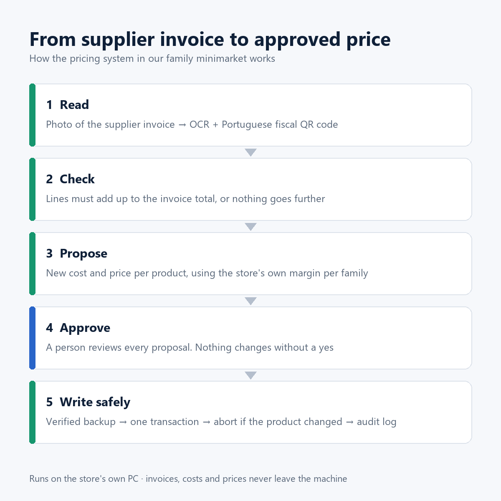

# Invoice → Price: safe pricing automation for a small retailer

I run operations at my family's minimarket near Lisbon. In September 2026 I built a system that reads
supplier invoices from phone photos, proves them against the Portuguese fiscal QR code, proposes new
costs and shelf prices, and writes only what a person approved. Every write has a verified backup, one
transaction and an undo log.

**This repository is a public demo.** It is a rewrite of the core ideas on SQLite with synthetic data, so
anyone can run it and read the tests. The production system and its data stay private ([why](#whats-not-here-and-why)).



---

## The problem

- The store has a catalogue of about 16,800 products in a legacy back-office (MS Access) that feeds the
  checkout (SQL Server). Another company owns that software.
- Updating a price meant reading each paper invoice, finding the product, recalculating the cost and
  typing the new price by hand. So prices fell behind costs.
- When I measured it, **37% of sales came from products whose cost had not been updated for more than two
  years**, and some products were being sold below cost.

## Constraints I set before writing any code

| Constraint | Why |
|---|---|
| Never change the vendor's programs; write only what their back-office itself writes | Their software is fiscally certified and runs the checkout |
| The program proposes, a person approves | Prices are a business decision |
| Writes are deterministic. AI may help *read* a photo, never decide a write | A wrong price costs money silently |
| Refuse instead of guessing | A refusal is visible; a wrong guess is not |
| Data stays on the store's PC (an 8-year-old i3, 8 GB, no GPU) | Supplier prices are sensitive; the hardware is what small shops have |

## How it works

1. **Read.** Local OCR on the photo, plus the fiscal QR code (Portaria 195/2020), which carries the
   supplier's tax number and the taxable base for each VAT rate.
2. **Check.** A row is only trusted if quantity × price = value. The whole invoice is only "proven" if the
   lines add up to the QR, VAT rate by VAT rate. A missing page shows up as a gap.
3. **Propose.** Cost up: keep the product's own margin. Cost down: keep the shelf price. Generic products,
   two suppliers, a different VAT rate or a cost far from the old one all go to a person.
4. **Approve.** In a phone app, a person ticks each change. On an unproven invoice nothing is pre-ticked.
5. **Write safely.** Simulate first; write only the plan that was simulated (fingerprint); verified
   backup; undo log written before the commit; one transaction with compare-and-swap on every column, so
   if anyone edited the product in the meantime, nothing is written.

## What went wrong, and how it was fixed

I commissioned two independent code audits (22 and 29 September), each run in a fresh session with no
memory of the build, before installing in a second store. Every finding became a regression test.

| When | Problem | What we did | Result |
|---|---|---|---|
| 16–17 Sep | Tried a vision-language model and a table model to read invoices | Measured them: 2 min/page with unusable output, and prices swapped between rows | Dropped. AI only flattens the curved photo; reading stays OCR + arithmetic |
| 17 Sep | Linking a barcode to the right invoice line | Measured on 55 real cases | Errors went from 5 and 23 to **0** |
| 21 Sep | "What if someone edits a product while we write?" | "Poison" test on copies of the database | Changed record → rollback, 0 rows written |
| 22 Sep, audit 1 | A generic "biscuits, any brand" product (325 barcodes) took the cost of one invoice line: margin 20% → 79% | Generic products and duplicate lines now need a person; big changes shown in red | Cost restored with the program's own undo; test added |
| 22 Sep, audit 1 | Two phones at once: two new products for one line; invoice files corrupted in 7 of 30 concurrency rounds | Atomic writes, locks, line reservation, unique IDs | Reproduced first, then fixed |
| 22 Sep, audit 1 | A write could succeed without an undo log and report "not saved" | Undo log written **before** the commit | Test added |
| 26–28 Sep | Reading took ~30 s per page on the store's PC class | Benchmarked engines; same output required on every page | **4.2× faster** with identical reading; PyTorch removed |
| 27 Sep | INT8 quantisation to go faster | Measured | Rejected: it misread numbers. The arithmetic checks caught all of them, so **0 wrong prices** |
| 29 Sep, audit 2 | **Critical:** with two lines for one product, a person confirmed the second and the writer stored the first line's cost (1.06 instead of 1.20) | Writer only uses lines with a price decision; refuses conflicts | Test reproduces the bug; fixed |
| 29 Sep, audit 2 | A learned confidence threshold of 90% picked 6 wrong lines out of 56 | Threshold to 99% (0 wrong of 5); never pre-tick on confidence alone | Weekly retraining now measured out of sample, deduplicated |
| 29 Sep, audit 2 | A forged QR could inject HTML into the app | Escaping, strict validation of tax number and date | Test added |

The full verification suite in production went from 10 checks to **23 of 23 passing**.

## What's in this repo

```
invoicepricing/
  qr.py        fiscal QR parser with strict validation
  lines.py     OCR rows -> lines; a row must close qty x price = value; ambiguity is flagged
  proof.py     lines vs QR, rate by rate
  pricing.py   the price rules and the cases that need a person
  apply.py     simulate / write / undo with fingerprint, backup, undo log, compare-and-swap
  report.py    read-only: products sold below cost ranked by money lost; stale costs; CSV for Power BI
  demo_data.py synthetic store, 12 months of sales and three sample invoices with real-world traps
tests/         22 tests, including regressions of the audit findings
```

## Run it

```bash
pip install pytest
python -m pytest -q                                   # 22 tests
python -m invoicepricing build                        # synthetic store + sample invoices
python -m invoicepricing price samples/invoice_01_clean.txt          # simulate
python -m invoicepricing price samples/invoice_01_clean.txt --write  # write the simulated plan
python -m invoicepricing undo logs/<the log printed above>
python -m invoicepricing summary samples/invoice_02_traps.txt   # read-only JSON for automations
python -m invoicepricing report                       # below-cost report + CSV for Power BI
```

The three sample invoices show a clean invoice that proves, an invoice with the traps from the audits
(two lines for one product, a 6,00% discount, a generic product), and an invoice with a missing page.

## Dashboard

The [Power BI model](powerbi/README.md) answers one question: where is the store losing margin because
prices fell behind costs? A static preview with the same measures (`python powerbi/preview_dashboard.py`):


## Automation

[`automation/`](automation/README.md) holds an n8n workflow that triages each new invoice: it runs the
read-only `summary` command, logs the invoice to a Google Sheet and emails either "ready to approve" or
"needs a person" with the reasons. It never writes a price.

## What's not here, and why

- **The production code.** It is a product I am preparing to offer to other stores that use the same
  back-office, and it describes another company's database. This demo is written from scratch.
- **Any real data.** Names, tax numbers, prices and sales here are synthetic.
- Production also has a phone app, barcode reading, a local text model for product suggestions, a
  remote-access setup over a private network, and scheduled routines. They are out of scope for a demo.

## How I worked

I built this with an AI coding assistant. I set the rules above, made every business decision, defined
what had to be measured, and commissioned the independent audits. The assistant wrote most of the code
under those rules. The habit that mattered most: **every real mistake became a test that fails if it
ever comes back.**

## About me

Pedro Mariano, Business Management student at ISCAL (Lisbon), finishing in 2027. Looking for a hybrid role
in Lisbon in business or finance systems analysis, finance automation or ERP.
[LinkedIn](https://www.linkedin.com/in/pedro-mariano-pt)
