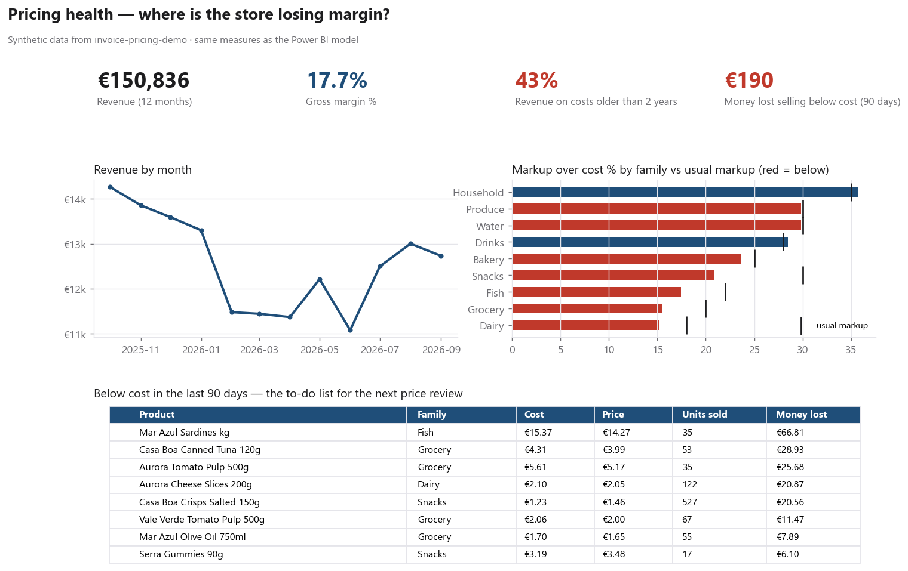

# Power BI: pricing health dashboard

Built on the CSV files that `python -m invoicepricing report` writes to `powerbi/data/` (synthetic data).
Question it answers: **where is the store losing margin because prices fell behind costs?**

## Data model (star schema)

| Table | Grain | Key |
|---|---|---|
| `fact_sales` | product × day | `product_code`, `day` |
| `fact_price_changes` | one row per price written or undone | `product_code` |
| `dim_product` | product | `code` |
| `dim_family` | product family, with its usual margin | `family` |
| `below_cost_90d` | products sold below cost in the last 90 days | `code` |
| `Calendar` | day (created in DAX, below) | `Date` |

Relationships (single direction, many-to-one):
`fact_sales[product_code]` → `dim_product[code]`, `fact_price_changes[product_code]` → `dim_product[code]`,
`below_cost_90d[code]` → `dim_product[code]`, `dim_product[family]` → `dim_family[family]`,
`fact_sales[day]` → `Calendar[Date]` (set `day` to type *Date* in Power Query).

## DAX

```DAX
Calendar = ADDCOLUMNS ( CALENDAR ( DATE ( 2025, 10, 1 ), DATE ( 2026, 9, 30 ) ),
    "Month", FORMAT ( [Date], "yyyy-mm" ), "Weekday", FORMAT ( [Date], "ddd" ) )

Revenue = SUM ( fact_sales[revenue] )
Units = SUM ( fact_sales[qty] )
Revenue ex VAT = SUMX ( fact_sales, fact_sales[revenue] / ( 1 + RELATED ( dim_product[vat] ) / 100 ) )
Cost of goods = SUMX ( fact_sales, fact_sales[qty] * RELATED ( dim_product[cost] ) )
Gross margin = [Revenue ex VAT] - [Cost of goods]
Gross margin % = DIVIDE ( [Gross margin], [Revenue ex VAT] )
Markup % = DIVIDE ( [Revenue ex VAT], [Cost of goods] ) - 1   -- same basis as dim_family[usual_margin] (% over cost)
Money lost below cost (90d) = SUM ( below_cost_90d[money_lost] )
Stale cost revenue % =
    DIVIDE ( CALCULATE ( [Revenue], dim_product[cost_date] < DATE ( 2024, 9, 30 ) ), [Revenue] )
Prices changed = COUNTROWS ( FILTER ( fact_price_changes, fact_price_changes[reason] <> "undo" ) )
```

## Pages

1. **Overview**: cards for Revenue, Gross margin %, Stale cost revenue % and Money lost below cost (90d);
   revenue by month (line); markup % by family against `dim_family[usual_margin]` (bars + target).
   `usual_margin` is a markup over cost, so it is compared with Markup %, not with Gross margin %.
2. **Below cost**: table from `below_cost_90d` sorted by money lost, with name, family, cost, price and
   units sold. This is the to-do list for the next price review.
3. **Price changes**: table of `fact_price_changes`, old → new cost and price, with the reason
   (`cost_up`, `cost_down`, `undo`).

Save the file as `powerbi/pricing_health.pbix` and a screenshot of each page in `docs/`.

## Preview without Power BI

`python powerbi/preview_dashboard.py` computes the same measures in pandas and draws the overview
and the below-cost list to `docs/dashboard.png`:


